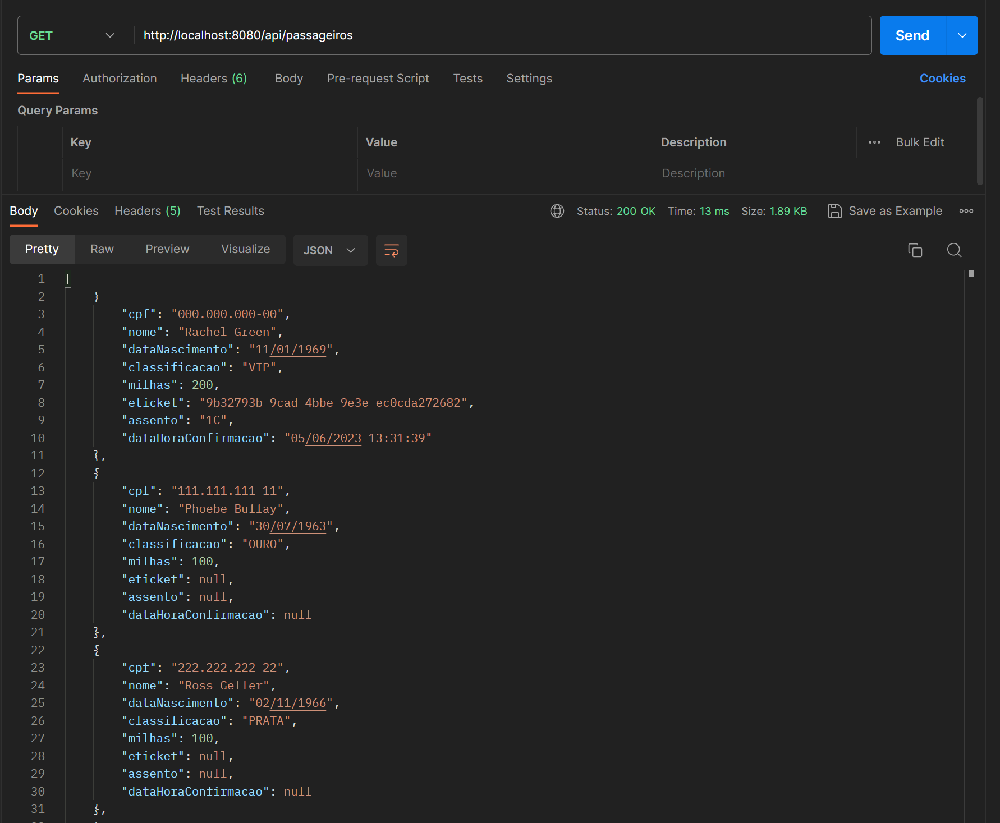
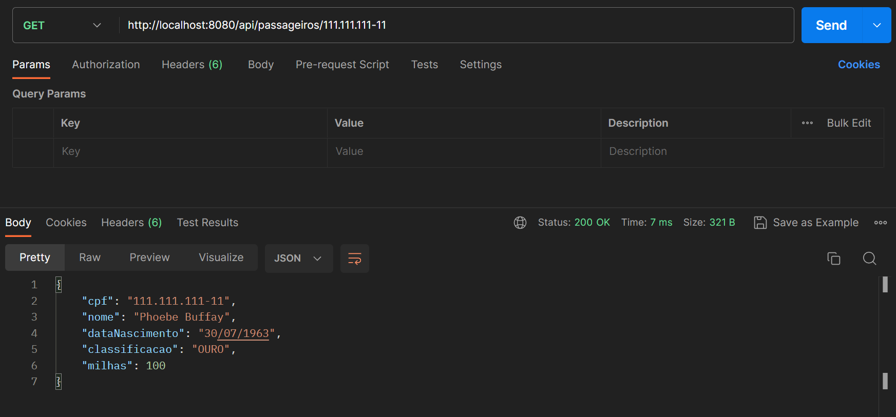
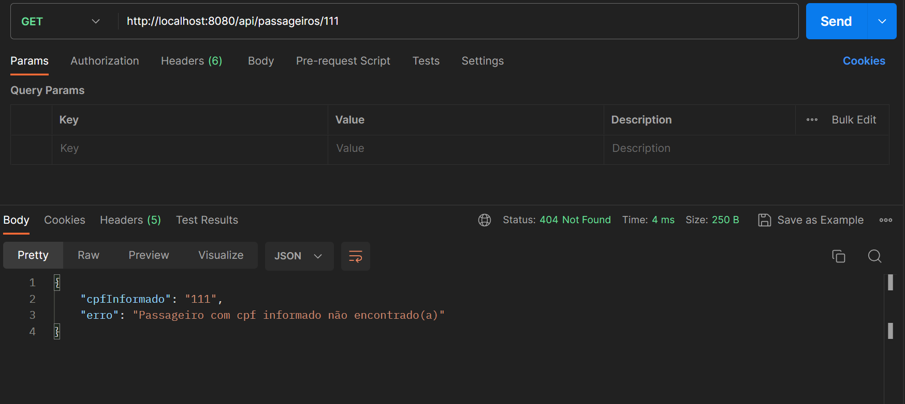
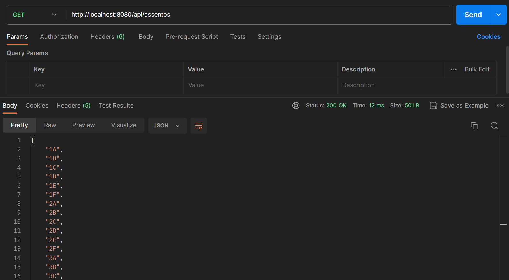
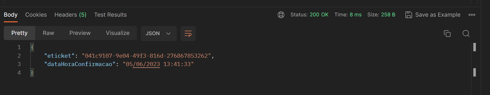

# LABSky - REST API - Java

## Conteúdos

- [Introdução](#introdução)
- [Resumo da Aplicação](#resumo-da-aplicação)
  - [Banco de Dados](#banco-de-dados)
  - [Entidades](#entidades)
    - [Passageiro](#passageiro)
    - [Assento](#assento)
    - [Bilhete de Embarque](#bilhete-de-embarque)
- [Endpoints](#endpoints)
  - [Consulta de dados completos de passageiro](#consulta-de-dados-completos-de-passageiros)
  - [Consulta de passageiro pelo cpf](#consulta-de-passageiro-pelo-cpf)
  - [Consulta de assentos](#consulta-de-assentos)
  - [Realizar confirmação(checkin)](#realizar-confirmação--checkin----emitir-bilhete-de-embarque)

<hr>

## Introdução

A LABSky Linhas Aéreas entrou em operação com uma aeronave para atender a um grupo seleto de clientes que fazem o trecho Florianópolis/SC - Santa Maria/RS diariamente. Você foi escolhido para criar o back-end de uma aplicação para gerenciar os passageiros que irão no voo.

A aplicação deve ser uma API REST desenvolvida em Java com Spring Boot, com testes unitários. A api servirá para controle de quais passageiros confirmaram (realizaram check-in) para o voo e qual assento foi selecionado.

## Resumo da aplicação


### Banco de Dados

Esta aplicação utiliza o banco de dados embarcado H2.

Ao iniciar a aplicação, através do script contido no arquivo [data.sql](https://github.com/ajhopf/LABSky/blob/main/src/main/resources/data.sql), 10 passageiros são inseridos no banco de dados, assim como os 66 assentos disponíveis na aeronave.

### Entidades

#### Passageiro

A entidade Passageiro tem os seguintes campos:

- CPF: Tipo String; Identificador do passageiro no sistema
- Nome: Tipo String
- Data de Nascimento: Tipo LocalDate
- Classificação: Tipo Enum; Categoria do passageiro no programa de fidelidade
- Milhas: Tipo Integer; Quantidade acumulada de milhas do passageiro

As possíveis classificações são: VIP, OURO, PRATA, BRONZE, ASSOCIADO.


#### Assento

A aeronave usada pela companhia possui 10 fileiras de assentos numeradas, com 6 poltronas cada, ordenadas de ‘A’ a ‘F’. Portanto, existem os seguintes assentos:

1A, 1B, 1C, 1D, 1E, 1F,
2A, 2B, 2C, 2D, 2E, 2F,
3A, 3B, 3C, 3D, 3E, 3F,
…
10A, 10B, 10C, 10D, 10E, 10F


#### Bilhete de Embarque

- Quando o passageiro confirma o voo (realiza o check-in), é gerada uma “Confirmação” (bilhete de embarque) com os novos campos:
- E-ticket: Tipo String; Identificador da confirmação; Gerado com UUID
- Assento: Tipo String; Assento escolhido pelo passageiro
- Malas Despachadas: Tipo Boolean; Indicador se serão despachadas malas
- Data e Hora da Confirmação: Tipo LocalDateTime; Data e hora

## Endpoints

### Consulta de dados completos de passageiros

- Requisição: HTTP GET
- Endpoint: /api/passageiros

- Exemplo de resposta


Note que o primeiro passageiro possui informações nos campos eticket, assento e dataHoraConfirmacao pois já realizou o checkin.

### Consulta de passageiro pelo CPF

- Requisição: HTTP GET
- Endpoint: /api/passageiros/{cpf}
- Exemplo de Resposta:



- Resposta no caso de registro não encontrado:



### Consulta de assentos

- Requisição: HTTP GET
- Endpoint: /api/assentos
- Exemplo de Resposta:



### Realizar confirmação (checkin) - emitir bilhete de embarque

- Requisição: HTTP POST
- Endpoint: /api/passageiros/confirmacao
- Campos do request body: cpf, assento, malasDespachas
```
{
    "cpf": "222.222.222-22",
    "assento": "5B",
    "malasDespachadas": true
}
```
- Exemplo de resposta:


Ao ser confirmado o checkin, será calculado o novo saldo de milhas do passageiro, obedecendo a sua classificação:

VIP → + 100 pontos
OURO → + 80 pontos
PRATA → + 50 pontos
BRONZE → + 30 pontos
ASSOCIADO → + 10 pontos

O novo saldo do passageiro pode ser visualizado através da consulta de todos passageiros, bem como os dados de checkin (eticket, assento e hora de confirmação).

Possíveis erros:

- Se não houver passageiro registrado com o CPF informado na requisição, uma mensagem de erro será enviada com HTTP Status Code 404 - Not Found.
- Se o assento informado na requisição não existir, uma mensagem de erro será enviada com HTTP Status Code 404 - Not Found.
- Se o assento indicado já estiver sido reservado para outro passageiro, uma mensagem de erro informativa será enviada com HTTP Status Code 409 - Conflict.
- As fileiras “5” e “6” da aeronave são consideradas “fileiras de emergência” (5A, 5B, 5C, 5D … 6D, 6E, 6F)  por estarem próximo à asa do avião, e os ocupantes destas fileiras devem estar aptos a realizar os procedimentos de emergência. Desta forma, se o passageiro for menor de idade (idade menor que 18 anos), ele não poderá escolher assentos destas duas fileiras. Portanto, caso o passageiro seja menor de idade e tenha escolhido uma das fileiras de emergência, uma mensagem de erro informativa será enviada com HTTP Status Code 400 - Bad Request.  
- Como as fileiras “5” e “6” da aeronave são consideradas “fileiras de emergência” estas tem layout diferenciado e não comportam bagagens pessoais trazidas pelos passageiros, os quais, se escolherem alguma das poltronas destas fileiras, devem obrigatoriamente despachar suas malas. Caso o passageiro tenha escolhido uma das fileiras de emergência e não tenha despachado as malas, uma mensagem de erro informativa será enviada com HTTP Status Code 400 - Bad Request. 
